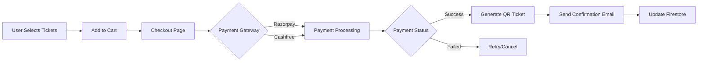
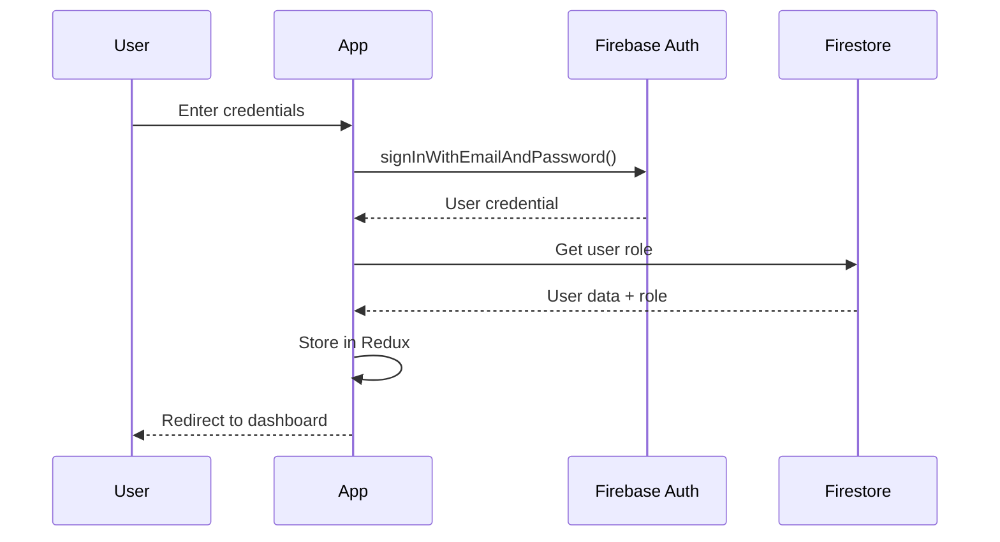

# FlowGateX - Complete Application Documentation

<div align="center">


**Enterprise-Grade Event Management Platform with IoT Integration**

[](https://vitejs.dev)
[](https://react.dev)
[](https://typescriptlang.org)
[](https://firebase.google.com)
[](https://tailwindcss.com)

[Features](#-core-features) • [Tech Stack](#-technology-stack) • [Getting Started](#-getting-started) • [Deployment](#-deployment) • [Documentation](#-documentation)

</div>

---

## 📑 Table of Contents

1. [Overview](#-overview)
2. [Core Features](#-core-features)
3. [Technology Stack](#-technology-stack)
4. [Architecture](#-architecture)
5. [Getting Started](#-getting-started)
6. [Project Structure](#-project-structure)
7. [Environment Configuration](#-environment-configuration)
8. [State Management](#-state-management)
9. [Authentication & Authorization](#-authentication--authorization)
10. [Payment Integration](#-payment-integration)
11. [IoT Integration](#-iot-integration)
12. [Deployment](#-deployment)
13. [Development Workflow](#-development-workflow)
14. [API Documentation](#-api-documentation)
15. [Security & Best Practices](#-security--best-practices)
16. [Performance Optimization](#-performance-optimization)
17. [Testing](#-testing)
18. [Troubleshooting](#-troubleshooting)
19. [Contributing](#-contributing)
20. [License](#-license)

---

## 🎯 Overview

### What is FlowGateX?

FlowGateX is a modern, production-ready event management platform that combines the power of real-time databases, secure authentication, payment processing, and IoT device integration to create a comprehensive solution for event organizers and attendees.

### Key Highlights

- 🚀 **Lightning Fast**: Built with Vite for instant HMR and optimized builds
- 🔒 **Enterprise Security**: Role-based access control with Firebase Auth
- 💳 **Payment Ready**: Integrated Razorpay and Cashfree gateways
- 📱 **Responsive Design**: Mobile-first approach with Tailwind CSS
- 🌐 **IoT Enabled**: Real-time device monitoring and access control
- 📊 **Analytics Rich**: Comprehensive dashboards for all user roles
- ♿ **Accessible**: WCAG 2.1 AA compliant with Material UI
- 🌍 **Production Ready**: Deployed on Vercel with edge optimization

### Use Cases

| Scenario | Solution |
|----------|----------|
| **Conference Management** | Multi-track events, speaker management, attendee networking |
| **Music Festivals** | Ticket tiers, QR-based entry, real-time capacity monitoring |
| **Corporate Events** | Employee registration, check-in systems, analytics |
| **Workshops & Seminars** | Limited capacity management, payment collection |
| **Hybrid Events** | Virtual + physical attendee management |

---

## ✨ Core Features

### 🎫 Event Management System

#### For Event Organizers
```typescript
// Comprehensive Event Creation
interface Event {
  title: string;
  description: string;
  category: EventCategory;
  venue: {
    name: string;
    address: string;
    coordinates: { lat: number; lng: number };
    capacity: number;
  };
  dates: {
    start: Date;
    end: Date;
    registrationDeadline: Date;
  };
  ticketTiers: TicketTier[];
  features: string[];
  mediaGallery: MediaFile[];
  iotDevices: IoTDevice[];
}
```

**Features:**
- ✅ Rich text editor for event descriptions
- ✅ Image gallery with drag-and-drop upload
- ✅ Multiple ticket tier configuration
- ✅ Dynamic pricing and discount codes
- ✅ Venue selection with Leaflet map (OpenStreetMap tiles)
- ✅ Recurring event templates
- ✅ Event cloning and duplication
- ✅ Draft, published, and archived states

#### For Attendees
- 🔍 Advanced search with filters (category, date, location, price)
- ⭐ Event favorites and watchlists
- 📅 Calendar integration (Google, Outlook, iCal)
- 🎟️ Digital ticket wallet
- 📱 Mobile QR tickets
- 🔔 Event reminders and notifications
- 💬 Event Q&A and discussions

### 🔐 Authentication & Authorization

#### Supported Authentication Methods

| Method | Provider | Features |
|--------|----------|----------|
| **Email/Password** | Firebase Auth | Email verification, password reset |
| **Google OAuth** | Firebase Auth | One-tap sign-in |
| **Phone Authentication** | Firebase Auth | OTP-based verification |
| **Anonymous Auth** | Firebase Auth | Guest checkout |

#### Role-Based Access Control (RBAC)

```typescript
enum UserRole {
  USER = 'user',           // Browse events, book tickets
  ORGANIZER = 'organizer', // Create/manage events
  ADMIN = 'admin'          // Platform administration
}

// Route Protection Example
<ProtectedRoute 
  requiredRole={UserRole.ORGANIZER}
  fallback="/unauthorized"
>
  <EventCreationPage />
</ProtectedRoute>
```

**Permission Matrix:**

| Feature | User | Organizer | Admin |
|---------|------|-----------|-------|
| Browse Events | ✅ | ✅ | ✅ |
| Book Tickets | ✅ | ✅ | ✅ |
| Create Events | ❌ | ✅ | ✅ |
| Manage Attendees | ❌ | ✅ (own events) | ✅ |
| IoT Device Management | ❌ | ✅ (own events) | ✅ |
| Platform Analytics | ❌ | ❌ | ✅ |
| User Management | ❌ | ❌ | ✅ |

### 💳 Payment Processing

#### Integrated Payment Gateways

**Primary: Razorpay**
```typescript
const razorpayConfig = {
  key: process.env.VITE_RAZORPAY_KEY_ID,
  features: [
    'UPI (Google Pay, PhonePe, Paytm)',
    'Credit/Debit Cards',
    'Net Banking (50+ banks)',
    'Wallets (Paytm, MobiKwik)',
    'EMI Options',
    'International Cards'
  ],
  fees: '2% + GST',
  settlement: 'T+2 days'
};
```

**Secondary: Cashfree**
- Lower transaction fees (1.99%)
- Faster settlement (T+1 day)
- Better UPI success rates

#### Payment Flow



**Payment Features:**
- 🔒 PCI DSS compliant processing
- 💰 Automatic refund handling
- 📧 Email/SMS confirmations
- 🧾 Invoice generation (PDF)
- 💸 Split payments for group bookings
- 🎁 Discount code validation
- 📊 Transaction history

### 📊 Analytics & Reporting

#### User Dashboard
- 📈 Booking history with status tracking
- 💰 Total spending analytics
- ⭐ Favorite events
- 🎟️ Upcoming events calendar
- 📥 Downloadable tickets

#### Organizer Dashboard
```typescript
interface OrganizerMetrics {
  events: {
    total: number;
    active: number;
    completed: number;
    draft: number;
  };
  revenue: {
    total: number;
    thisMonth: number;
    breakdown: RevenueByTicketTier[];
  };
  attendees: {
    total: number;
    checkedIn: number;
    pendingCheckIn: number;
  };
  performance: {
    popularEvents: Event[];
    salesTrends: ChartData[];
    conversionRate: number;
  };
}
```

**Visualizations:**
- 📊 Revenue trend charts (Recharts)
- 🥧 Ticket distribution pie charts
- 📈 Attendance growth graphs
- 🗺️ Geographic distribution maps
- ⏰ Real-time attendee check-in

#### Admin Dashboard
- 👥 Platform-wide user analytics
- 💼 Organizer performance metrics
- 💰 Revenue reports by category
- 🚨 System health monitoring
- 📱 IoT device fleet status

### 🌐 IoT Device Integration

#### Supported Devices
- 🚪 **Smart Access Gates**: QR/NFC readers
- 📷 **IP Cameras**: Live venue monitoring
- 🔊 **PA Systems**: Automated announcements
- 🌡️ **Environmental Sensors**: Temperature, humidity
- 👥 **Crowd Counters**: Real-time capacity tracking

#### Device Management

```typescript
interface IoTDevice {
  id: string;
  name: string;
  type: 'access_gate' | 'camera' | 'sensor';
  status: 'online' | 'offline' | 'error';
  location: {
    venue: string;
    zone: string;
  };
  capabilities: string[];
  lastSync: Date;
  metrics: {
    scansToday: number;
    errorRate: number;
    uptime: number;
  };
}
```

**Real-Time Features:**
- 🔴 Live device status monitoring
- 📡 Firestore WebSocket sync
- 🔔 Instant offline alerts
- 📋 Activity logs and audit trails
- 🛠️ Remote configuration updates

#### QR Code Validation Flow
```typescript
// Ticket Validation at Gate
async function validateTicket(qrCode: string, deviceId: string) {
  const ticket = await getTicketByQR(qrCode);
  
  if (!ticket.isValid()) {
    return { status: 'invalid', reason: 'Ticket expired/cancelled' };
  }
  
  if (ticket.isAlreadyScanned()) {
    return { status: 'duplicate', reason: 'Already checked in' };
  }
  
  await markTicketAsScanned(ticket.id, deviceId);
  await logDeviceActivity(deviceId, 'scan_success', ticket.id);
  
  return { status: 'success', attendee: ticket.attendee };
}
```

### 🤖 AI-Powered Features

#### ChatBot Support
- 💬 24/7 customer support
- ❓ FAQ automation
- 🎫 Booking assistance
- 🔍 Event recommendations
- 📞 Escalation to human agents

#### Smart Recommendations
```typescript
// AI-driven event suggestions
const recommendations = await getPersonalizedEvents({
  userId: currentUser.id,
  factors: [
    'browsing_history',
    'booking_history',
    'favorite_categories',
    'location_preferences',
    'price_range'
  ]
});
```

---

## 🛠️ Technology Stack

### Frontend Architecture

```
┌─────────────────────────────────────────────────────┐
│                  React 18.3.1                       │
│  (Concurrent Features, Automatic Batching, SSR)     │
├─────────────────────────────────────────────────────┤
│                  Vite 6.0.11                        │
│  (Lightning Fast HMR, ESM, Rollup Bundler)          │
├─────────────────────────────────────────────────────┤
│                TypeScript 5.7.2                     │
│  (Strict Mode, Path Aliases, Type Safety)           │
└─────────────────────────────────────────────────────┘
```

### Core Dependencies

#### UI & Styling
| Package | Version | Purpose |
|---------|---------|---------|
| `@mui/material` | ^7.3.7 | Component library |
| `@mui/icons-material` | ^7.3.7 | Material icons |
| `@emotion/react` | ^11.14.0 | CSS-in-JS for MUI |
| `@emotion/styled` | ^11.14.0 | Styled components |
| `tailwindcss` | ^3.4.17 | Utility-first CSS |
| `framer-motion` | ^11.15.0 | Animation library |
| `lucide-react` | ^0.469.0 | Modern icons |

#### Routing & State
| Package | Version | Purpose |
|---------|---------|---------|
| `react-router-dom` | ^7.1.3 | Client-side routing |
| `@reduxjs/toolkit` | ^2.5.0 | Global state |
| `react-redux` | ^9.2.0 | React-Redux bindings |
| `zustand` | ^5.0.2 | Lightweight state |
| `@tanstack/react-query` | ^5.62.8 | Server state |

#### Forms & Validation
| Package | Version | Purpose |
|---------|---------|---------|
| `react-hook-form` | ^7.54.0 | Form management |
| `zod` | ^3.24.1 | Schema validation |
| `@hookform/resolvers` | ^3.9.1 | Validation bridge |

#### Backend & Services
| Package | Version | Purpose |
|---------|---------|---------|
| `firebase` | ^11.10.0 | Auth, Firestore, Storage |
| `firebase-admin` | ^12.7.0 | Server-side SDK |
| `axios` | ^1.7.9 | HTTP client |

#### Utilities & Tools
| Package | Version | Purpose |
|---------|---------|---------|
| `recharts` | ^2.15.0 | Data visualization |
| `dayjs` | ^1.11.13 | Date manipulation |
| `razorpay` | ^2.9.6 | Payment processing |
| `qrcode.react` | ^4.2.0 | QR generation |
| `html5-qrcode` | ^2.3.8 | QR scanning |
| `sweetalert2` | ^11.26.17 | Beautiful alerts |
| `fuse.js` | ^7.1.0 | Fuzzy search |
| `lodash` | ^4.17.21 | Utility functions |

### Development Tools

| Tool | Purpose |
|------|---------|
| **Vite DevTools** | Development server, HMR |
| **ESLint** | Code linting |
| **Prettier** | Code formatting |
| **TypeScript** | Type checking |
| **Husky** | Git hooks |
| **lint-staged** | Pre-commit linting |

---

## 🏗️ Architecture

### Application Architecture

```
┌─────────────────────────────────────────────────────────────┐
│                        USER INTERFACE                        │
│  (React Components, Material UI, Tailwind CSS)              │
├─────────────────────────────────────────────────────────────┤
│                      ROUTING LAYER                           │
│  (React Router 7, Protected Routes, Role Guards)            │
├─────────────────────────────────────────────────────────────┤
│                    STATE MANAGEMENT                          │
│  ┌─────────────┬──────────────┬──────────────┐             │
│  │ TanStack    │   Redux      │   Zustand    │             │
│  │  Query      │   Toolkit    │              │             │
│  │ (Server)    │  (Auth)      │   (UI)       │             │
│  └─────────────┴──────────────┴──────────────┘             │
├─────────────────────────────────────────────────────────────┤
│                      SERVICE LAYER                           │
│  (API Services, Firebase Services, Payment Services)        │
├─────────────────────────────────────────────────────────────┤
│                     BACKEND SERVICES                         │
│  ┌─────────────┬──────────────┬──────────────┐             │
│  │  Firebase   │  Razorpay/   │   Google     │             │
│  │  (BaaS)     │  Cashfree    │   Maps       │             │
│  └─────────────┴──────────────┴──────────────┘             │
└─────────────────────────────────────────────────────────────┘
```

### Folder Structure Strategy

FlowGateX follows a **feature-based architecture** with clear separation of concerns:

```
src/
├── features/              # Feature modules (domain logic)
│   ├── auth/              # Authentication feature
│   │   ├── components/    # Auth-specific components
│   │   ├── hooks/         # Auth hooks
│   │   ├── services/      # Auth API calls
│   │   ├── types/         # Auth TypeScript types
│   │   └── utils/         # Auth utilities
│   ├── events/            # Event management feature
│   ├── booking/           # Booking system feature
│   └── analytics/         # Analytics feature
├── components/            # Shared/global components
│   ├── common/            # Buttons, Cards, Badges
│   ├── layout/            # Navbar, Sidebar, Footer
│   └── forms/             # Form controls
├── hooks/                 # Shared custom hooks
├── lib/                   # Core utilities & configs
├── pages/                 # Route-level components
├── routes/                # Routing configuration
├── services/              # Shared API services
├── store/                 # Global state (Redux/Zustand)
├── styles/                # Global styles & themes
└── types/                 # Shared TypeScript types
```

### State Management Strategy

```typescript
// 1️⃣ SERVER STATE (TanStack Query) - Remote data
const { data: events, isLoading } = useQuery({
  queryKey: ['events', filters],
  queryFn: () => fetchEvents(filters),
  staleTime: 5 * 60 * 1000, // 5 minutes
});

// 2️⃣ CLIENT STATE (Redux Toolkit) - Global app state
const user = useSelector((state) => state.auth.user);
const dispatch = useDispatch();
dispatch(loginSuccess(userData));

// 3️⃣ UI STATE (Zustand) - Ephemeral UI state
const { isOpen, toggle } = useSidebarStore();
const { theme, setTheme } = useThemeStore();
```

### Component Patterns

#### Server Component (Data Fetching)
```typescript
// Good: Fetch data close to where it's used
function EventList() {
  const { data: events } = useQuery({
    queryKey: ['events'],
    queryFn: eventService.getAllEvents,
  });

  return <EventGrid events={events} />;
}
```

#### Client Component (Interactivity)
```typescript
'use client'; // Vite equivalent: component with hooks

function EventCard({ event }) {
  const [isFavorite, setIsFavorite] = useState(false);
  
  return (
    <Card onClick={() => setIsFavorite(!isFavorite)}>
      {/* ... */}
    </Card>
  );
}
```

---

## 🚀 Getting Started

### Prerequisites

Ensure you have the following installed:

| Tool | Minimum Version | Recommended |
|------|-----------------|-------------|
| **Node.js** | 18.0.0 | 20.x LTS |
| **npm** | 9.0.0 | 10.x |
| **Git** | 2.30.0 | Latest |

Check versions:
```bash
node --version  # Should be >= 18
npm --version   # Should be >= 9
git --version
```

### Installation

#### Option 1: Clone from GitHub

```bash
# 1. Clone the repository
git clone https://github.com/yourusername/flowgatex.git
cd flowgatex

# 2. Install dependencies
npm install

# 3. Set up environment variables
cp .env.example .env.local

# 4. Edit .env.local with your credentials
nano .env.local  # or use your preferred editor
```

#### Option 2: Start from Scratch

```bash
# 1. Create Vite project
npm create vite@latest flowgatex -- --template react-ts

# 2. Navigate to project
cd flowgatex

# 3. Install core dependencies
npm install react-router-dom @reduxjs/toolkit react-redux zustand
npm install @tanstack/react-query axios
npm install firebase
npm install @mui/material @emotion/react @emotion/styled
npm install tailwindcss autoprefixer postcss
npm install react-hook-form zod @hookform/resolvers

# 4. Install dev dependencies
npm install -D @types/node eslint prettier
npm install -D vite-tsconfig-paths vite-plugin-pwa

# 5. Initialize Tailwind CSS
npx tailwindcss init -p
```

### Firebase Setup

#### 1. Create Firebase Project

```bash
# Go to Firebase Console: https://console.firebase.google.com
# 1. Click "Add Project"
# 2. Name: FlowGateX
# 3. Enable Google Analytics (optional)
```

#### 2. Enable Firebase Services

**Authentication:**
- Go to Authentication → Sign-in method
- Enable: Email/Password, Google, Phone

**Firestore Database:**
- Go to Firestore Database → Create database
- Start in production mode
- Choose location (asia-south1 for India)

**Storage:**
- Go to Storage → Get started
- Start in production mode

**Cloud Messaging:**
- Go to Cloud Messaging → Configure

#### 3. Get Firebase Configuration

```javascript
// Firebase Console → Project Settings → Your apps → Web app
const firebaseConfig = {
  apiKey: "AIza...",
  authDomain: "flowgatex.firebaseapp.com",
  projectId: "flowgatex",
  storageBucket: "flowgatex.appspot.com",
  messagingSenderId: "1234567890",
  appId: "1:1234567890:web:abcdef"
};
```

#### 4. Set Security Rules

**Firestore Rules:**
```javascript
rules_version = '2';
service cloud.firestore {
  match /databases/{database}/documents {
    // Users collection
    match /users/{userId} {
      allow read: if request.auth != null;
      allow write: if request.auth.uid == userId;
    }
    
    // Events collection
    match /events/{eventId} {
      allow read: if true;
      allow create: if request.auth != null && 
                      get(/databases/$(database)/documents/users/$(request.auth.uid)).data.role == 'organizer';
      allow update, delete: if request.auth != null && 
                              resource.data.organizerId == request.auth.uid;
    }
    
    // Bookings collection
    match /bookings/{bookingId} {
      allow read: if request.auth.uid == resource.data.userId;
      allow create: if request.auth != null;
    }
  }
}
```

**Storage Rules:**
```javascript
rules_version = '2';
service firebase.storage {
  match /b/{bucket}/o {
    match /event-images/{allPaths=**} {
      allow read: if true;
      allow write: if request.auth != null && 
                     request.resource.size < 5 * 1024 * 1024; // 5MB limit
    }
  }
}
```

### Payment Gateway Setup

#### Razorpay Configuration

```bash
# 1. Sign up: https://razorpay.com
# 2. Go to Settings → API Keys
# 3. Generate Test Keys (for development)

# Test Credentials
VITE_RAZORPAY_KEY_ID=rzp_test_xxxxxxxxxxxxx
RAZORPAY_KEY_SECRET=xxxxxxxxxxxxxxxxxxxxxxxx
```

**Test Card Details:**
```
Card Number: 4111 1111 1111 1111
CVV: 123
Expiry: Any future date
```

#### Cashfree Configuration

```bash
# 1. Sign up: https://cashfree.com
# 2. Get API credentials from Dashboard

VITE_CASHFREE_APP_ID=xxxxxxxxxxxxx
CASHFREE_SECRET_KEY=xxxxxxxxxxxxx
```

### Environment Variables

Create `.env.local` file:

```env
# ========================================
# FIREBASE CONFIGURATION
# ========================================
VITE_FIREBASE_API_KEY=AIzaSyXXXXXXXXXXXXXXXXXXXXXXXXXXXXXXX
VITE_FIREBASE_AUTH_DOMAIN=flowgatex.firebaseapp.com
VITE_FIREBASE_PROJECT_ID=flowgatex
VITE_FIREBASE_STORAGE_BUCKET=flowgatex.appspot.com
VITE_FIREBASE_MESSAGING_SENDER_ID=1234567890
VITE_FIREBASE_APP_ID=1:1234567890:web:abcdefghijk
VITE_FIREBASE_MEASUREMENT_ID=G-XXXXXXXXXX

# Firebase Admin SDK (for server-side operations)
FIREBASE_SERVICE_ACCOUNT_KEY='{"type":"service_account",...}'

# ========================================
# PAYMENT GATEWAYS
# ========================================
# Razorpay
VITE_RAZORPAY_KEY_ID=rzp_test_xxxxxxxxxxxxx
RAZORPAY_KEY_SECRET=xxxxxxxxxxxxxxxxxxxxxxxx

# Cashfree
VITE_CASHFREE_APP_ID=xxxxxxxxxxxxx
CASHFREE_SECRET_KEY=xxxxxxxxxxxxx

# ========================================
# MAPS
# ========================================
# Leaflet + OpenStreetMap (no API key required)

# ========================================
# APPLICATION CONFIGURATION
# ========================================
VITE_APP_NAME=FlowGateX
VITE_APP_URL=http://localhost:3000
VITE_API_BASE_URL=http://localhost:3000/api

# ========================================
# FEATURE FLAGS
# ========================================
VITE_ENABLE_ANALYTICS=true
VITE_ENABLE_PWA=true
VITE_ENABLE_CHATBOT=true
```

### Running the Application

```bash
# Development mode (with HMR)
npm run dev

# Build for production
npm run build

# Preview production build
npm run preview

# Run linting
npm run lint

# Format code
npm run format

# Type checking
npm run type-check
```

Access the application:
- **Development**: http://localhost:3000
- **Preview**: http://localhost:4173

---

## 📁 Project Structure

### Complete Directory Overview

```
flowgatex/
│
├── public/                           # Static assets
│   ├── favicon.ico
│   ├── logo.png
│   ├── manifest.json                 # PWA manifest
│   └── robots.txt
│
├── src/
│   │
│   ├── assets/                       # Media assets
│   │   ├── images/
│   │   ├── icons/
│   │   └── fonts/
│   │
│   ├── components/                   # Shared components
│   │   ├── common/
│   │   │   ├── Button.tsx
│   │   │   ├── Card.tsx
│   │   │   ├── Modal.tsx
│   │   │   ├── Badge.tsx
│   │   │   ├── Spinner.tsx
│   │   │   └── Toast.tsx
│   │   ├── layout/
│   │   │   ├── Navbar.tsx
│   │   │   ├── Sidebar.tsx
│   │   │   ├── Footer.tsx
│   │   │   └── Layout.tsx
│   │   └── forms/
│   │       ├── Input.tsx
│   │       ├── Select.tsx
│   │       ├── DatePicker.tsx
│   │       └── FileUpload.tsx
│   │
│   ├── features/                     # Feature modules
│   │   │
│   │   ├── auth/
│   │   │   ├── components/
│   │   │   │   ├── LoginForm.tsx
│   │   │   │   ├── RegisterForm.tsx
│   │   │   │   ├── ForgotPassword.tsx
│   │   │   │   └── SocialAuth.tsx
│   │   │   ├── hooks/
│   │   │   │   ├── useAuth.ts
│   │   │   │   ├── useLogin.ts
│   │   │   │   └── useRegister.ts
│   │   │   ├── services/
│   │   │   │   └── authService.ts
│   │   │   ├── types/
│   │   │   │   └── auth.types.ts
│   │   │   └── utils/
│   │   │       └── validation.ts
│   │   │
│   │   ├── events/
│   │   │   ├── components/
│   │   │   │   ├── EventCard.tsx
│   │   │   │   ├── EventGrid.tsx
│   │   │   │   ├── EventDetails.tsx
│   │   │   │   ├── EventFilters.tsx
│   │   │   │   └── CreateEvent/
│   │   │   │       ├── BasicInfoStep.tsx
│   │   │   │       ├── VenueStep.tsx
│   │   │   │       ├── TicketsStep.tsx
│   │   │   │       └── ReviewStep.tsx
│   │   │   ├── hooks/
│   │   │   │   ├── useEvents.ts
│   │   │   │   ├── useEventDetails.ts
│   │   │   │   └── useCreateEvent.ts
│   │   │   ├── services/
│   │   │   │   └── eventService.ts
│   │   │   └── types/
│   │   │       └── event.types.ts
│   │   │
│   │   ├── booking/
│   │   │   ├── components/
│   │   │   │   ├── Cart.tsx
│   │   │   │   ├── Checkout.tsx
│   │   │   │   ├── TicketSelection.tsx
│   │   │   │   └── BookingConfirmation.tsx
│   │   │   ├── hooks/
│   │   │   │   ├── useCart.ts
│   │   │   │   └── useCheckout.ts
│   │   │   ├── services/
│   │   │   │   └── bookingService.ts
│   │   │   └── types/
│   │   │       └── booking.types.ts
│   │   │
│   │   ├── payment/
│   │   │   ├── components/
│   │   │   │   ├── RazorpayButton.tsx
│   │   │   │   └── PaymentStatus.tsx
│   │   │   ├── hooks/
│   │   │   │   └── usePayment.ts
│   │   │   ├── services/
│   │   │   │   ├── razorpayService.ts
│   │   │   │   └── cashfreeService.ts
│   │   │   └── types/
│   │   │       └── payment.types.ts
│   │   │
│   │   ├── analytics/
│   │   │   ├── components/
│   │   │   │   ├── RevenueChart.tsx
│   │   │   │   ├── AttendanceChart.tsx
│   │   │   │   ├── MetricsCard.tsx
│   │   │   │   └── Dashboard.tsx
│   │   │   ├── hooks/
│   │   │   │   └── useAnalytics.ts
│   │   │   └── types/
│   │   │       └── analytics.types.ts
│   │   │
│   │   ├── iot/
│   │   │   ├── components/
│   │   │   │   ├── DeviceList.tsx
│   │   │   │   ├── DeviceCard.tsx
│   │   │   │   ├── QRScanner.tsx
│   │   │   │   └── DeviceMonitor.tsx
│   │   │   ├── hooks/
│   │   │   │   ├── useDevices.ts
│   │   │   │   └── useQRScanner.ts
│   │   │   ├── services/
│   │   │   │   └── iotService.ts
│   │   │   └── types/
│   │   │       └── iot.types.ts
│   │   │
│   │   ├── organizer/
│   │   │   ├── components/
│   │   │   │   ├── OrganizerDashboard.tsx
│   │   │   │   ├── EventManagement.tsx
│   │   │   │   └── AttendeeList.tsx
│   │   │   └── hooks/
│   │   │       └── useOrganizerStats.ts
│   │   │
│   │   ├── admin/
│   │   │   ├── components/
│   │   │   │   ├── AdminDashboard.tsx
│   │   │   │   ├── UserManagement.tsx
│   │   │   │   └── SystemSettings.tsx
│   │   │   └── hooks/
│   │   │       └── useAdminStats.ts
│   │   │
│   │   └── chat/
│   │       ├── components/
│   │       │   ├── ChatWidget.tsx
│   │       │   └── ChatMessage.tsx
│   │       └── hooks/
│   │           └── useChat.ts
│   │
│   ├── hooks/                        # Shared custom hooks
│   │   ├── useDebounce.ts
│   │   ├── useLocalStorage.ts
│   │   ├── useMediaQuery.ts
│   │   ├── useOnClickOutside.ts
│   │   └── useWindowSize.ts
│   │
│   ├── lib/                          # Core utilities
│   │   ├── firebase.ts               # Firebase initialization
│   │   ├── api.ts                    # Axios instance
│   │   ├── utils.ts                  # Helper functions
│   │   ├── constants.ts              # App constants
│   │   └── queryClient.ts            # React Query config
│   │
│   ├── pages/                        # Page components
│   │   ├── auth/
│   │   │   ├── LoginPage.tsx
│   │   │   ├── RegisterPage.tsx
│   │   │   └── ForgotPasswordPage.tsx
│   │   ├── dashboard/
│   │   │   ├── UserDashboard.tsx
│   │   │   ├── OrganizerDashboard.tsx
│   │   │   └── AdminDashboard.tsx
│   │   ├── events/
│   │   │   ├── EventsPage.tsx
│   │   │   ├── EventDetailsPage.tsx
│   │   │   ├── CreateEventPage.tsx
│   │   │   └── ManageEventPage.tsx
│   │   ├── booking/
│   │   │   ├── CheckoutPage.tsx
│   │   │   └── BookingSuccessPage.tsx
│   │   ├── public/
│   │   │   ├── HomePage.tsx
│   │   │   ├── AboutPage.tsx
│   │   │   └── ContactPage.tsx
│   │   └── NotFoundPage.tsx
│   │
│   ├── routes/                       # Routing configuration
│   │   ├── AppRoutes.tsx             # Main router
│   │   ├── ProtectedRoute.tsx        # Auth guard
│   │   ├── RoleRoute.tsx             # Role guard
│   │   └── routes.config.ts          # Route definitions
│   │
│   ├── services/                     # API services
│   │   ├── api/
│   │   │   ├── authApi.ts
│   │   │   ├── eventApi.ts
│   │   │   ├── bookingApi.ts
│   │   │   └── userApi.ts
│   │   └── firebase/
│   │       ├── authService.ts
│   │       ├── firestoreService.ts
│   │       └── storageService.ts
│   │
│   ├── store/                        # State management
│   │   ├── redux/
│   │   │   ├── store.ts              # Redux store
│   │   │   ├── slices/
│   │   │   │   ├── authSlice.ts
│   │   │   │   ├── userSlice.ts
│   │   │   │   └── notificationSlice.ts
│   │   │   └── hooks.ts              # Typed hooks
│   │   └── zustand/
│   │       ├── cartStore.ts
│   │       ├── themeStore.ts
│   │       └── sidebarStore.ts
│   │
│   ├── styles/                       # Global styles
│   │   ├── globals.css               # Global CSS + Tailwind
│   │   ├── theme.ts                  # MUI theme
│   │   └── variables.css             # CSS variables
│   │
│   ├── types/                        # TypeScript types
│   │   ├── index.ts
│   │   ├── api.types.ts
│   │   ├── common.types.ts
│   │   └── firebase.types.ts
│   │
│   ├── App.tsx                       # Root component
│   ├── main.tsx                      # Entry point
│   └── vite-env.d.ts                 # Vite types
│
├── .env.example                      # Environment template
├── .env.local                        # Local environment (gitignored)
├── .eslintrc.cjs                     # ESLint config
├── .prettierrc                       # Prettier config
├── .gitignore
├── index.html                        # HTML template
├── package.json
├── package-lock.json
├── postcss.config.js                 # PostCSS config
├── tailwind.config.js                # Tailwind config
├── tsconfig.json                     # TypeScript config
├── tsconfig.node.json                # Node TS config
├── vite.config.ts                    # Vite configuration
├── vercel.json                       # Vercel deployment
└── README.md
```

---

## 🔐 Environment Configuration

### Environment Files

| File | Purpose | Git Tracked |
|------|---------|-------------|
| `.env.example` | Template with all variables | ✅ Yes |
| `.env.local` | Local development secrets | ❌ No |
| `.env.production` | Production values (Vercel) | ❌ No |

### Variable Naming Convention

```env
# Public variables (accessible in browser)
VITE_VARIABLE_NAME=value

# Private variables (server-side only)
VARIABLE_NAME=value
```

### Loading Environment Variables

```typescript
// ✅ Correct - Public variable
const apiKey = import.meta.env.VITE_FIREBASE_API_KEY;

// ❌ Wrong - Won't work (not prefixed with VITE_)
const secret = import.meta.env.FIREBASE_SECRET;

// Type-safe environment variables
interface ImportMetaEnv {
  readonly VITE_FIREBASE_API_KEY: string;
  readonly VITE_FIREBASE_PROJECT_ID: string;
  readonly VITE_RAZORPAY_KEY_ID: string;
}

interface ImportMeta {
  readonly env: ImportMetaEnv;
}
```

---

## 📦 State Management

### Three-Tier Architecture

#### 1. Server State (TanStack Query)

**Use for:** Remote data, API calls, caching

```typescript
// queries/eventQueries.ts
export const eventQueries = {
  all: () => ['events'] as const,
  lists: () => [...eventQueries.all(), 'list'] as const,
  list: (filters: EventFilters) => 
    [...eventQueries.lists(), filters] as const,
  details: () => [...eventQueries.all(), 'detail'] as const,
  detail: (id: string) => 
    [...eventQueries.details(), id] as const,
};

// Using in component
function EventList() {
  const { data, isLoading, error } = useQuery({
    queryKey: eventQueries.list({ category: 'music' }),
    queryFn: () => eventService.getEvents({ category: 'music' }),
    staleTime: 5 * 60 * 1000, // 5 minutes
    cacheTime: 10 * 60 * 1000, // 10 minutes
  });

  if (isLoading) return <Spinner />;
  if (error) return <Error message={error.message} />;
  
  return <EventGrid events={data} />;
}
```

**Mutations:**
```typescript
function CreateEventForm() {
  const queryClient = useQueryClient();
  
  const mutation = useMutation({
    mutationFn: eventService.createEvent,
    onSuccess: () => {
      // Invalidate and refetch
      queryClient.invalidateQueries({ 
        queryKey: eventQueries.lists() 
      });
      toast.success('Event created!');
    },
  });

  const onSubmit = (data) => {
    mutation.mutate(data);
  };

  return <EventForm onSubmit={onSubmit} />;
}
```

#### 2. Client State (Redux Toolkit)

**Use for:** Authentication, user sessions, global app state

```typescript
// store/slices/authSlice.ts
import { createSlice, PayloadAction } from '@reduxjs/toolkit';

interface AuthState {
  user: User | null;
  isAuthenticated: boolean;
  loading: boolean;
  error: string | null;
}

const initialState: AuthState = {
  user: null,
  isAuthenticated: false,
  loading: true,
  error: null,
};

const authSlice = createSlice({
  name: 'auth',
  initialState,
  reducers: {
    setUser: (state, action: PayloadAction<User>) => {
      state.user = action.payload;
      state.isAuthenticated = true;
      state.loading = false;
    },
    logout: (state) => {
      state.user = null;
      state.isAuthenticated = false;
    },
    setLoading: (state, action: PayloadAction<boolean>) => {
      state.loading = action.payload;
    },
  },
});

export const { setUser, logout, setLoading } = authSlice.actions;
export default authSlice.reducer;

// Usage
function Navbar() {
  const { user, isAuthenticated } = useAppSelector((state) => state.auth);
  const dispatch = useAppDispatch();

  const handleLogout = () => {
    dispatch(logout());
  };

  return <Nav user={user} onLogout={handleLogout} />;
}
```

#### 3. UI State (Zustand)

**Use for:** Modals, sidebars, themes, ephemeral UI state

```typescript
// store/zustand/themeStore.ts
import { create } from 'zustand';
import { persist } from 'zustand/middleware';

interface ThemeState {
  theme: 'light' | 'dark' | 'system';
  setTheme: (theme: 'light' | 'dark' | 'system') => void;
  toggleTheme: () => void;
}

export const useThemeStore = create<ThemeState>()(
  persist(
    (set, get) => ({
      theme: 'system',
      setTheme: (theme) => set({ theme }),
      toggleTheme: () => 
        set({ theme: get().theme === 'light' ? 'dark' : 'light' }),
    }),
    {
      name: 'theme-storage',
    }
  )
);

// Usage
function ThemeToggle() {
  const { theme, toggleTheme } = useThemeStore();

  return (
    <IconButton onClick={toggleTheme}>
      {theme === 'light' ? <MoonIcon /> : <SunIcon />}
    </IconButton>
  );
}
```

**Cart Store Example:**
```typescript
// store/zustand/cartStore.ts
interface CartItem {
  ticketId: string;
  quantity: number;
  price: number;
}

interface CartState {
  items: CartItem[];
  addItem: (item: CartItem) => void;
  removeItem: (ticketId: string) => void;
  updateQuantity: (ticketId: string, quantity: number) => void;
  clearCart: () => void;
  total: () => number;
}

export const useCartStore = create<CartState>((set, get) => ({
  items: [],
  addItem: (item) => set((state) => ({
    items: [...state.items, item],
  })),
  removeItem: (ticketId) => set((state) => ({
    items: state.items.filter((i) => i.ticketId !== ticketId),
  })),
  updateQuantity: (ticketId, quantity) => set((state) => ({
    items: state.items.map((i) =>
      i.ticketId === ticketId ? { ...i, quantity } : i
    ),
  })),
  clearCart: () => set({ items: [] }),
  total: () => {
    const { items } = get();
    return items.reduce((sum, item) => sum + item.price * item.quantity, 0);
  },
}));
```

---

## 🔐 Authentication & Authorization

### Firebase Authentication Flow



### Implementation

#### Authentication Service

```typescript
// services/firebase/authService.ts
import { 
  signInWithEmailAndPassword,
  createUserWithEmailAndPassword,
  signOut,
  GoogleAuthProvider,
  signInWithPopup,
} from 'firebase/auth';
import { doc, setDoc, getDoc } from 'firebase/firestore';
import { auth, db } from '@/lib/firebase';

export const authService = {
  // Email/Password Sign In
  async signIn(email: string, password: string) {
    const credential = await signInWithEmailAndPassword(
      auth,
      email,
      password
    );
    const userDoc = await getDoc(
      doc(db, 'users', credential.user.uid)
    );
    return {
      ...credential.user,
      ...userDoc.data(),
    };
  },

  // Email/Password Sign Up
  async signUp(email: string, password: string, userData: UserData) {
    const credential = await createUserWithEmailAndPassword(
      auth,
      email,
      password
    );
    
    // Create user document
    await setDoc(doc(db, 'users', credential.user.uid), {
      uid: credential.user.uid,
      email,
      ...userData,
      role: 'user',
      createdAt: new Date(),
    });

    return credential.user;
  },

  // Google Sign In
  async signInWithGoogle() {
    const provider = new GoogleAuthProvider();
    const credential = await signInWithPopup(auth, provider);
    
    // Check if user exists
    const userDoc = await getDoc(
      doc(db, 'users', credential.user.uid)
    );
    
    if (!userDoc.exists()) {
      // Create new user document
      await setDoc(doc(db, 'users', credential.user.uid), {
        uid: credential.user.uid,
        email: credential.user.email,
        displayName: credential.user.displayName,
        photoURL: credential.user.photoURL,
        role: 'user',
        createdAt: new Date(),
      });
    }

    return credential.user;
  },

  // Sign Out
  async signOut() {
    await signOut(auth);
  },
};
```

#### Protected Routes

```typescript
// routes/ProtectedRoute.tsx
import { Navigate, Outlet } from 'react-router-dom';
import { useAppSelector } from '@/store/redux/hooks';

export function ProtectedRoute() {
  const { isAuthenticated, loading } = useAppSelector((state) => state.auth);

  if (loading) {
    return <Spinner />;
  }

  return isAuthenticated ? <Outlet /> : <Navigate to="/login" />;
}

// routes/RoleRoute.tsx
interface RoleRouteProps {
  allowedRoles: UserRole[];
}

export function RoleRoute({ allowedRoles }: RoleRouteProps) {
  const { user } = useAppSelector((state) => state.auth);

  if (!user) {
    return <Navigate to="/login" />;
  }

  if (!allowedRoles.includes(user.role)) {
    return <Navigate to="/unauthorized" />;
  }

  return <Outlet />;
}
```

#### Route Configuration

```typescript
// routes/AppRoutes.tsx
import { Routes, Route } from 'react-router-dom';
import { ProtectedRoute } from './ProtectedRoute';
import { RoleRoute } from './RoleRoute';

export function AppRoutes() {
  return (
    <Routes>
      {/* Public Routes */}
      <Route path="/" element={<HomePage />} />
      <Route path="/login" element={<LoginPage />} />
      <Route path="/register" element={<RegisterPage />} />
      <Route path="/events" element={<EventsPage />} />
      <Route path="/events/:id" element={<EventDetailsPage />} />

      {/* Protected Routes */}
      <Route element={<ProtectedRoute />}>
        <Route path="/dashboard" element={<UserDashboard />} />
        <Route path="/bookings" element={<MyBookings />} />
        <Route path="/profile" element={<ProfilePage />} />
      </Route>

      {/* Organizer Routes */}
      <Route element={<RoleRoute allowedRoles={['organizer', 'admin']} />}>
        <Route path="/organizer/dashboard" element={<OrganizerDashboard />} />
        <Route path="/organizer/events/create" element={<CreateEventPage />} />
        <Route path="/organizer/events/:id/edit" element={<EditEventPage />} />
        <Route path="/organizer/analytics" element={<AnalyticsPage />} />
      </Route>

      {/* Admin Routes */}
      <Route element={<RoleRoute allowedRoles={['admin']} />}>
        <Route path="/admin/dashboard" element={<AdminDashboard />} />
        <Route path="/admin/users" element={<UserManagement />} />
        <Route path="/admin/settings" element={<SystemSettings />} />
      </Route>

      <Route path="*" element={<NotFoundPage />} />
    </Routes>
  );
}
```

---

## 💳 Payment Integration

### Razorpay Implementation

#### Setup

```typescript
// lib/razorpay.ts
import Razorpay from 'razorpay';

export const razorpayClient = new Razorpay({
  key_id: import.meta.env.VITE_RAZORPAY_KEY_ID,
  key_secret: import.meta.env.RAZORPAY_KEY_SECRET,
});
```

#### Payment Flow

```typescript
// services/paymentService.ts
export const paymentService = {
  // Create Razorpay Order
  async createOrder(amount: number, currency = 'INR') {
    const options = {
      amount: amount * 100, // Convert to paise
      currency,
      receipt: `receipt_${Date.now()}`,
    };

    const order = await razorpayClient.orders.create(options);
    return order;
  },

  // Initialize Payment
  async initiatePayment(orderData: OrderData) {
    const order = await this.createOrder(orderData.amount);

    const options = {
      key: import.meta.env.VITE_RAZORPAY_KEY_ID,
      amount: order.amount,
      currency: order.currency,
      name: 'FlowGateX',
      description: orderData.description,
      order_id: order.id,
      handler: async (response: any) => {
        // Verify payment
        await this.verifyPayment(response);
      },
      prefill: {
        name: orderData.user.name,
        email: orderData.user.email,
        contact: orderData.user.phone,
      },
      theme: {
        color: '#6366f1',
      },
    };

    const razorpay = new window.Razorpay(options);
    razorpay.open();
  },

  // Verify Payment
  async verifyPayment(paymentResponse: any) {
    const { razorpay_order_id, razorpay_payment_id, razorpay_signature } = 
      paymentResponse;

    // Send to backend for verification
    const response = await axios.post('/api/payment/verify', {
      orderId: razorpay_order_id,
      paymentId: razorpay_payment_id,
      signature: razorpay_signature,
    });

    return response.data;
  },
};
```

#### React Component

```typescript
// features/payment/components/RazorpayButton.tsx
import { usePayment } from '../hooks/usePayment';

interface RazorpayButtonProps {
  amount: number;
  eventId: string;
  tickets: TicketSelection[];
}

export function RazorpayButton({ 
  amount, 
  eventId, 
  tickets 
}: RazorpayButtonProps) {
  const { user } = useAppSelector((state) => state.auth);
  const { initiatePayment, isProcessing } = usePayment();

  const handlePayment = async () => {
    const orderData = {
      amount,
      description: `Tickets for Event ${eventId}`,
      user: {
        name: user.displayName,
        email: user.email,
        phone: user.phone,
      },
      eventId,
      tickets,
    };

    await initiatePayment(orderData);
  };

  return (
    <Button
      onClick={handlePayment}
      disabled={isProcessing}
      variant="contained"
      size="large"
    >
      {isProcessing ? 'Processing...' : `Pay ₹${amount}`}
    </Button>
  );
}
```

### Payment Webhook

```typescript
// api/payment/webhook.ts
import crypto from 'crypto';

export async function verifyRazorpayWebhook(
  req: Request
): Promise<boolean> {
  const signature = req.headers.get('x-razorpay-signature');
  const body = await req.text();

  const expectedSignature = crypto
    .createHmac('sha256', process.env.RAZORPAY_WEBHOOK_SECRET)
    .update(body)
    .digest('hex');

  return signature === expectedSignature;
}

export async function handlePaymentWebhook(data: any) {
  const { event, payload } = data;

  switch (event) {
    case 'payment.captured':
      await handlePaymentSuccess(payload.payment.entity);
      break;
    case 'payment.failed':
      await handlePaymentFailure(payload.payment.entity);
      break;
    default:
      console.log('Unhandled event:', event);
  }
}
```

---

## 🌐 IoT Integration

### Device Registration

```typescript
// services/iotService.ts
export const iotService = {
  // Register Device
  async registerDevice(deviceData: IoTDeviceData) {
    const docRef = await addDoc(collection(db, 'iot_devices'), {
      ...deviceData,
      status: 'offline',
      createdAt: serverTimestamp(),
      lastSync: null,
    });

    return docRef.id;
  },

  // Update Device Status
  async updateDeviceStatus(deviceId: string, status: DeviceStatus) {
    await updateDoc(doc(db, 'iot_devices', deviceId), {
      status,
      lastSync: serverTimestamp(),
    });
  },

  // Log Device Activity
  async logActivity(deviceId: string, activity: ActivityLog) {
    await addDoc(collection(db, 'iot_activity_logs'), {
      deviceId,
      ...activity,
      timestamp: serverTimestamp(),
    });
  },

  // Validate QR Code
  async validateQRCode(qrCode: string, deviceId: string) {
    const ticketRef = doc(db, 'tickets', qrCode);
    const ticketDoc = await getDoc(ticketRef);

    if (!ticketDoc.exists()) {
      return { valid: false, reason: 'Ticket not found' };
    }

    const ticket = ticketDoc.data();

    if (ticket.used) {
      return { valid: false, reason: 'Ticket already used' };
    }

    if (new Date(ticket.validUntil) < new Date()) {
      return { valid: false, reason: 'Ticket expired' };
    }

    // Mark as used
    await updateDoc(ticketRef, {
      used: true,
      usedAt: serverTimestamp(),
      scannedBy: deviceId,
    });

    await this.logActivity(deviceId, {
      type: 'ticket_scan',
      ticketId: qrCode,
      status: 'success',
    });

    return { valid: true, ticket };
  },
};
```

### Real-Time Device Monitoring

```typescript
// features/iot/hooks/useDeviceMonitor.ts
export function useDeviceMonitor(eventId: string) {
  const [devices, setDevices] = useState<IoTDevice[]>([]);

  useEffect(() => {
    const q = query(
      collection(db, 'iot_devices'),
      where('eventId', '==', eventId)
    );

    const unsubscribe = onSnapshot(q, (snapshot) => {
      const updatedDevices = snapshot.docs.map((doc) => ({
        id: doc.id,
        ...doc.data(),
      })) as IoTDevice[];

      setDevices(updatedDevices);
    });

    return () => unsubscribe();
  }, [eventId]);

  return { devices };
}
```

---

## 🚀 Deployment

### Vercel Deployment Steps

#### 1. Prerequisites
```bash
# Install Vercel CLI
npm i -g vercel

# Login
vercel login
```

#### 2. Project Configuration

Create `vercel.json`:
```json
{
  "buildCommand": "npm run build",
  "outputDirectory": "dist",
  "devCommand": "npm run dev",
  "installCommand": "npm install",
  "framework": "vite",
  "regions": ["bom1", "sin1"],
  "env": {
    "VITE_FIREBASE_API_KEY": "@firebase-api-key",
    "VITE_FIREBASE_PROJECT_ID": "@firebase-project-id"
  },
  "headers": [
    {
      "source": "/(.*)",
      "headers": [
        {
          "key": "X-Content-Type-Options",
          "value": "nosniff"
        },
        {
          "key": "X-Frame-Options",
          "value": "DENY"
        },
        {
          "key": "X-XSS-Protection",
          "value": "1; mode=block"
        }
      ]
    }
  ],
  "rewrites": [
    {
      "source": "/(.*)",
      "destination": "/index.html"
    }
  ]
}
```

#### 3. Deploy

```bash
# Deploy to production
vercel --prod

# Or use Git integration
# 1. Push to GitHub
git push origin main

# 2. Vercel auto-deploys
```

#### 4. Environment Variables

Add in Vercel Dashboard:
- Go to Project Settings → Environment Variables
- Add all variables from `.env.local`
- Set scope: Production, Preview, Development

### Performance Optimization

#### Vite Configuration

```typescript
// vite.config.ts
import { defineConfig } from 'vite';
import react from '@vitejs/plugin-react';
import { VitePWA } from 'vite-plugin-pwa';
import tsconfigPaths from 'vite-tsconfig-paths';

export default defineConfig({
  plugins: [
    react(),
    tsconfigPaths(),
    VitePWA({
      registerType: 'autoUpdate',
      includeAssets: ['favicon.ico', 'logo.png'],
      manifest: {
        name: 'FlowGateX',
        short_name: 'FlowGateX',
        description: 'Enterprise Event Management Platform',
        theme_color: '#6366f1',
        icons: [
          {
            src: 'logo.png',
            sizes: '192x192',
            type: 'image/png',
          },
        ],
      },
    }),
  ],
  build: {
    rollupOptions: {
      output: {
        manualChunks: {
          'react-vendor': ['react', 'react-dom', 'react-router-dom'],
          'mui-vendor': ['@mui/material', '@emotion/react'],
          'firebase-vendor': ['firebase/app', 'firebase/auth', 'firebase/firestore'],
          'chart-vendor': ['recharts'],
        },
      },
    },
    chunkSizeWarningLimit: 1000,
  },
});
```

#### Code Splitting

```typescript
// Lazy load routes
import { lazy, Suspense } from 'react';

const EventsPage = lazy(() => import('@/pages/events/EventsPage'));
const CheckoutPage = lazy(() => import('@/pages/booking/CheckoutPage'));

function App() {
  return (
    <Suspense fallback={<PageLoader />}>
      <Routes>
        <Route path="/events" element={<EventsPage />} />
        <Route path="/checkout" element={<CheckoutPage />} />
      </Routes>
    </Suspense>
  );
}
```

---

## 🧪 Testing

### Unit Testing (Vitest)

```bash
# Install Vitest
npm install -D vitest @testing-library/react @testing-library/jest-dom
```

```typescript
// Button.test.tsx
import { render, screen } from '@testing-library/react';
import { Button } from './Button';

describe('Button', () => {
  it('renders correctly', () => {
    render(<Button>Click me</Button>);
    expect(screen.getByText('Click me')).toBeInTheDocument();
  });

  it('handles click events', () => {
    const handleClick = vi.fn();
    render(<Button onClick={handleClick}>Click me</Button>);
    
    screen.getByText('Click me').click();
    expect(handleClick).toHaveBeenCalledTimes(1);
  });
});
```

### E2E Testing (Playwright)

```bash
# Install Playwright
npm install -D @playwright/test
npx playwright install
```

```typescript
// tests/e2e/login.spec.ts
import { test, expect } from '@playwright/test';

test('user can login', async ({ page }) => {
  await page.goto('http://localhost:3000/login');
  
  await page.fill('[name="email"]', 'test@example.com');
  await page.fill('[name="password"]', 'password123');
  await page.click('button[type="submit"]');
  
  await expect(page).toHaveURL('/dashboard');
});
```

---

## 🛡️ Security & Best Practices

### Security Checklist

- [x] Environment variables for sensitive data
- [x] HTTPS enforced in production
- [x] CSP headers configured
- [x] Input validation with Zod
- [x] Firebase Security Rules
- [x] XSS protection
- [x] CSRF protection
- [x] Rate limiting on API endpoints
- [x] Secure password hashing
- [x] JWT token expiration

### Code Quality

```bash
# Linting
npm run lint

# Type checking
npm run type-check

# Formatting
npm run format

# Pre-commit hooks
npx husky install
npx husky add .husky/pre-commit "npm run lint && npm run type-check"
```

---

## 📝 License

MIT License - See [LICENSE](LICENSE) file for details

---

## 🤝 Contributing

We welcome contributions! Please see [CONTRIBUTING.md](CONTRIBUTING.md) for guidelines.

---

## 📞 Support

- **Documentation**: [Full Docs](https://flowgatex.com/docs)
- **Email**: support@flowgatex.com
- **Discord**: [Join Community](https://discord.gg/flowgatex)
- **GitHub Issues**: [Report Bug](https://github.com/yourusername/flowgatex/issues)

---

<div align="center">

**Built with ❤️ using Vite, React, Firebase, and TypeScript**

[⬆ Back to Top](#flowgatex---complete-application-documentation)

</div>
