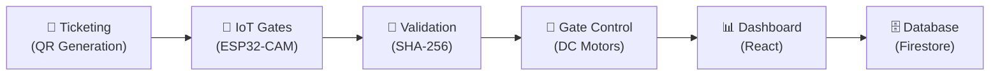
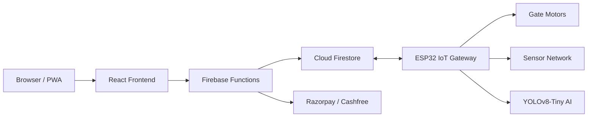
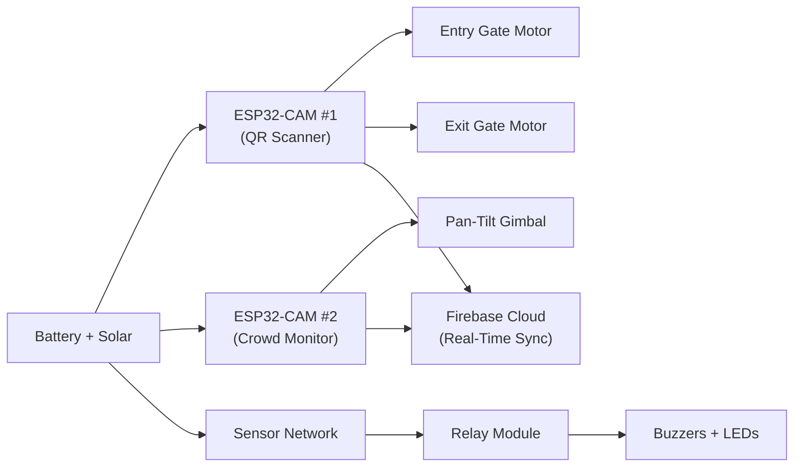
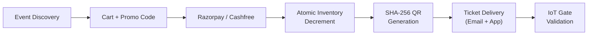
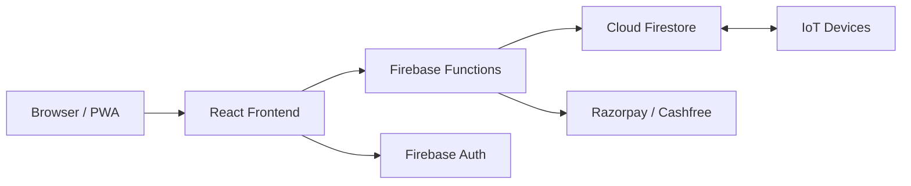
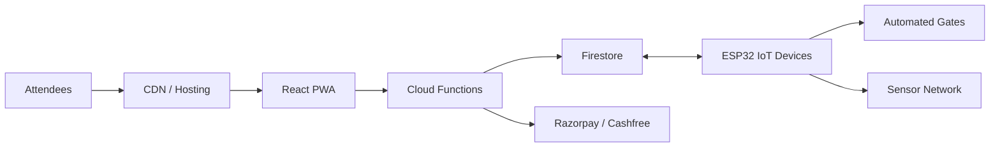

<p align="center">
  
</p>

<h1 align="center">🎫 FlowGateX</h1>

<p align="center">
  <strong>Enterprise-Grade Smart Event & Venue Management Platform with IoT-Powered Crowd Control</strong><br/>
  Smart ticketing, IoT gate control, real-time crowd monitoring, and venue safety intelligence
</p>

<p align="center">
  
  
  
  
  
  
  
  
  
</p>

---

## 📋 Table of Contents

- [Project Overview](#-project-overview)
- [Key Features](#-key-features)
- [System Overview](#-system-overview)
- [System Architecture](#-system-architecture)
- [IoT Hardware & Smart Venue System](#-iot-hardware--smart-venue-system)
- [AI Crowd Monitoring System](#-ai-crowd-monitoring-system)
- [Booking & Payment Pipeline](#-booking--payment-pipeline)
- [Web Application Platform](#-web-application-platform)
- [Development & API](#-development--api)
- [Getting Started](#-getting-started)
- [Deployment & Operations](#-deployment--operations)
- [Project Structure](#-project-structure)
- [Tech Stack](#-tech-stack)
- [Documentation](#-documentation)
- [Contributing](#-contributing)
- [License](#-license)

---

## 🌟 Project Overview

**FlowGateX** is an enterprise-grade, full-stack **smart event and venue management platform** that bridges the gap between digital ticketing and physical access control. It combines a powerful cloud-native Progressive Web Application with an advanced IoT hardware infrastructure — featuring dual ESP32-CAM modules, automated gate control systems, comprehensive sensor networks, and AI-powered crowd monitoring.

### The Problem

Modern event management platforms stop at the digital ticket, leaving critical gaps:

- ❌ **Fraud-prone** — traditional tickets are easily duplicated and lack cryptographic verification
- ❌ **Disconnected** — digital ticketing and physical gate access operate as separate, siloed systems
- ❌ **Unsafe** — venues lack real-time crowd density monitoring and environmental threat detection
- ❌ **Blind** — organizers have zero visibility into gate throughput, crowd patterns, or safety hazards
- ❌ **Delayed** — security personnel rely on manual monitoring, leading to slow incident response

### The Solution

FlowGateX solves these challenges through a **single unified platform** that handles the **entire event lifecycle** — from discovery to post-event analytics — combining:

- 🎫 **Cryptographic QR ticketing** (SHA-256 signed, tamper-proof validation)
- 🚪 **IoT automated gate control** (Dual DC motor entry/exit gates with ESP32)
- 🧠 **AI crowd monitoring** (YOLOv8-Tiny person detection on ESP32-CAM)
- 🌡️ **Venue safety intelligence** (Temperature, gas, metal detection sensor network)
- 📊 **Real-time analytics dashboards** (React 19 + TypeScript, revenue & attendance tracking)

> **Unlike conventional event platforms, FlowGateX extends into the physical venue** through a comprehensive IoT ecosystem — transforming venues into smart, secure, and intelligent spaces where technology works invisibly to create exceptional experiences.

### Supported Event Types

| Event Category   | Application                                     |
| ---------------- | ----------------------------------------------- |
| Conferences      | Multi-track sessions with tier-based gating     |
| Music Festivals  | High-throughput crowd monitoring & gate control |
| Corporate Events | RBAC-driven access with analytics dashboards    |
| Sports Venues    | Capacity management with real-time occupancy    |
| Trade Shows      | Zone-based access control with QR validation    |
| Workshops        | Small-venue automated entry with safety sensors |

📄 _Full details:_ [`Docs/About.md`](Docs/About.md)

---

## ✨ Key Features

| Feature                              | Description                                                            |
| ------------------------------------ | ---------------------------------------------------------------------- |
| 🎫 **Cryptographic QR Ticketing**    | SHA-256 signed QR codes with tamper-proof hardware validation          |
| 🚪 **IoT Automated Gate Control**    | Dual DC motor gates with ESP32-controlled entry/exit                   |
| 📹 **AI Crowd Monitoring**           | ESP32-CAM with YOLOv8-Tiny person detection and density tracking       |
| 🔐 **4-Tier Enterprise RBAC**        | Attendee → Organizer → Admin → Super Admin with 40+ permissions        |
| 💳 **Dual Payment Gateways**         | Razorpay (primary) + Cashfree (fallback) with atomic inventory control |
| 📊 **Real-Time Analytics Dashboard** | Revenue trends, attendance patterns, gate throughput, crowd heatmaps   |
| 📱 **Progressive Web App (PWA)**     | Installable with offline capability and push notifications             |
| 🌡️ **Safety Sensor Network**         | DHT22 (temp/humidity), MQ-2 (gas), Metal Detector with alerts          |
| 📦 **Multi-Tier Ticketing**          | Multiple ticket tiers with pricing, gate access levels, promo codes    |
| 🔔 **Intelligent Alert System**      | Overcapacity warnings, gas detection, metal detection notifications    |

---

## 🔍 System Overview

FlowGateX is a **Hybrid Cloud + IoT** platform consisting of six major subsystems that work together in a real-time, bidirectional pipeline:



### Technology Stack at a Glance

| Layer            | Technology                     | Purpose                                     |
| ---------------- | ------------------------------ | ------------------------------------------- |
| **Frontend**     | React 19 + TypeScript          | Event dashboard, booking UI, analytics      |
| **Styling**      | Tailwind CSS 4 + Framer Motion | Responsive design & micro-animations        |
| **State**        | Zustand                        | Lightweight reactive state management       |
| **Backend**      | Firebase Cloud Functions       | Serverless API & business logic             |
| **Database**     | Firebase Cloud Firestore       | Real-time event, ticket, and sensor data    |
| **Auth**         | Firebase Authentication        | 4-tier RBAC with custom claims              |
| **Payments**     | Razorpay + Cashfree            | Dual payment gateway processing             |
| **IoT Hardware** | ESP32-CAM (×2) + Sensors       | QR scanning, crowd monitoring, gate control |
| **AI**           | YOLOv8-Tiny (on-device)        | Person detection & crowd counting           |
| **Hosting**      | Firebase / Vercel / Netlify    | Multi-platform production deployment        |

### Core Capabilities

- **Smart QR Ticketing** — SHA-256 signed, cryptographically validated QR tickets
- **Automated Gate Control** — Dual DC motor entry/exit gates with ESP32 relay modules
- **AI Crowd Monitoring** — YOLOv8-Tiny person detection with zone heatmap generation
- **Real-Time Sensor Network** — Temperature, humidity, gas, metal detection monitoring
- **Multi-Tier RBAC** — 4 roles, 40+ granular permissions, 12 resource domains
- **Dual Payment Processing** — Razorpay + Cashfree with atomic inventory transactions

📄 _Full details:_ [`Docs/About.md`](Docs/About.md)

---

## 🏗️ System Architecture

FlowGateX follows a **hybrid cloud + IoT architecture** where digital ticketing, physical access control, and venue intelligence are unified through well-defined interfaces and real-time bidirectional sync.

### High-Level Architecture



### Architecture Layers

| #   | Layer                         | Responsibility                                               |
| --- | ----------------------------- | ------------------------------------------------------------ |
| 1   | **Frontend (React 19)**       | Event discovery, booking, dashboards, PWA experience         |
| 2   | **State (Zustand)**           | Cart sync, auth state, real-time UI reactivity               |
| 3   | **Backend (Cloud Functions)** | Serverless API, payment processing, ticket validation logic  |
| 4   | **Database (Firestore)**      | Events, tickets, bookings, sensor data, crowd analytics      |
| 5   | **Auth (Firebase Auth)**      | 4-tier RBAC with custom claims and 5-layer resolution engine |
| 6   | **IoT Gateway (ESP32)**       | QR scanning, gate motor control, sensor data collection      |
| 7   | **AI Module (YOLOv8-Tiny)**   | On-device person detection and crowd counting                |
| 8   | **Sensor Network**            | DHT22, MQ-2, Metal Detector, relay modules, alert buzzers    |

### Design Advantages

- **Hybrid architecture** — cloud-native web platform with edge IoT processing
- **Real-time sync** — bidirectional Firestore sync between dashboard and IoT devices
- **Modular IoT** — add gates, cameras, or sensors independently per venue
- **Multi-deploy** — Firebase, Vercel, Netlify, Docker, or Nginx in parallel

📄 _Full details:_ [`Docs/About.md`](Docs/About.md)

---

## 🔧 IoT Hardware & Smart Venue System

> **This is what sets FlowGateX apart.** The platform extends beyond software into a comprehensive IoT ecosystem featuring automated gate control, multi-sensor safety monitoring, dual ESP32-CAM systems for QR validation and AI-powered crowd analytics, and real-time environmental surveillance.

### Hardware Components

| Component                       | Purpose                                     | Qty |
| ------------------------------- | ------------------------------------------- | --- |
| ESP32-CAM Module #1             | QR code scanning & ticket validation        | 1   |
| ESP32-CAM Module #2             | Crowd monitoring & AI person detection      | 1   |
| DC Gear Motor (12V, 10 kg-cm)   | Automated gate open/close (Entry + Exit)    | 2   |
| 2-Channel Relay Module (5V/12V) | Motor & alert system control                | 2   |
| SG90 Servo Motors               | Camera pan-tilt gimbal for crowd cam        | 2   |
| DHT22 Sensor                    | Temperature (-40~80°C) & humidity (0-100%)  | 1   |
| MQ-2 Gas Sensor                 | LPG, smoke, CO detection (300-10K ppm)      | 1   |
| Metal Detector Module           | Security screening (pulse induction, 3-5cm) | 1   |
| RGB LED Array                   | Status indicators across gate system        | 5   |
| Active Piezo Buzzer (90dB)      | Audio alerts for entry/exit/security        | 2   |
| LiPo Battery (3.7V 5000mAh)     | Portable power supply with voltage reg.     | 1   |
| Solar Charging Circuit (6V 1W)  | Sustainable power top-up                    | 1   |

### IoT Architecture



### Automated Gate System

- **Entry Gate (Gate 1):** Opens on valid QR scan → remains open 5 seconds → auto-closes with IR safety sensor
- **Exit Gate (Gate 2):** Opens on button press or exit scan → auto-closes after passage with safety mat
- **Response Time:** < 2 seconds from QR trigger to fully open gate
- **Motor Specs:** 12V DC Gear Motor, 10 kg-cm torque, 90° rotation, variable speed (0-60 RPM)

### ESP32-CAM #1 — QR Scanner

- OV2640 camera (2MP, 1600×1200, wide angle)
- ZXing QR decoder library
- SHA-256 ticket verification with Firebase real-time sync
- RGB LED indicators (green = valid, red = invalid, amber = error)
- WiFi 802.11 b/g/n + MQTT client

### ESP32-CAM #2 — Crowd Monitor

- OV2640 camera with night vision IR LEDs
- 2-axis servo gimbal (Pan: 180°, Tilt: 90°)
- YOLOv8-Tiny person detection & crowd counter
- Zone-based heatmap generator
- Overcapacity density alert system

📄 _Full details:_ [`Hardware/`](Hardware/)

---

## 🧠 AI Crowd Monitoring System

The AI Crowd Monitoring System runs **on-device** on ESP32-CAM Module #2, providing real-time person detection and crowd analytics without cloud dependency.

### Detection Capabilities

| Task                    | Description                                             |
| ----------------------- | ------------------------------------------------------- |
| Person Detection        | Identifies individual attendees in camera field of view |
| Crowd Counting          | Real-time per-frame head count for venue zones          |
| Density Estimation      | Crowd density calculation per defined zone              |
| Zone Heatmap Generation | Visual heatmap of high-traffic / high-density areas     |
| Overcapacity Alerting   | Automated alerts when density exceeds safety thresholds |

### YOLOv8 Model Configuration

| Variant         | Parameters | Speed       | Usage                             |
| --------------- | ---------- | ----------- | --------------------------------- |
| **YOLOv8-Tiny** | **3.2M**   | **Fastest** | **FlowGateX default (on-device)** |
| YOLOv8n         | 3.2M       | Fast        | Alternative edge deployment       |
| YOLOv8s         | 11.2M      | Balanced    | Server-side processing (optional) |

### On-Device Inference — No Cloud Required

**Advantages of edge AI inference:**

- ✅ No internet dependency — works in WiFi-limited venue environments
- ✅ Ultra-low latency — sub-second detection response on ESP32
- ✅ Privacy-preserving — video frames processed locally, never uploaded
- ✅ Reliable — continues monitoring during cloud outages

### Example Crowd Analytics Output

```json
{
  "zone": "main_entrance",
  "person_count": 47,
  "density": 0.72,
  "capacity_utilization": "68%",
  "alert_level": "normal",
  "timestamp": "2026-06-11T10:34:12Z"
}
```

📄 _Full details:_ [`Docs/About.md`](Docs/About.md)

---

## 💳 Booking & Payment Pipeline

FlowGateX implements a **production-grade booking and payment pipeline** with atomic inventory control, dual payment gateways, and cryptographic ticket generation.

### Atomic Inventory Control

Firestore transactions prevent overselling — ticket availability is checked and decremented in a **single atomic operation**, ensuring consistency even under high-concurrency booking scenarios.

### Dual Payment Gateways

| Gateway      | Role               | Integration Type     |
| ------------ | ------------------ | -------------------- |
| **Razorpay** | Primary            | Client-side checkout |
| **Cashfree** | Secondary/Fallback | Server-side          |
| **Mock**     | Development        | Automatic fallback   |

### Cryptographic QR Ticket Generation

Each ticket is embedded with a **SHA-256 signed QR code** containing:

```json
{
  "ticketId": "TKT-2026-ABCD",
  "userId": "uid_12345",
  "eventId": "EVT-2026-XYZ",
  "transactionId": "TXN-9876",
  "bookingId": "BKG-5432",
  "timestamp": "2026-06-11T10:00:00Z",
  "gateAccessLevel": "premium"
}
```

The payload is **Base64-encoded and tamper-verifiable** — validated by ESP32-CAM #1 at the physical gate.

### Pipeline Flow



### Additional Payment Features

- **Promo Code Engine** — percentage or flat discounts with expiry, limits, and event-scoped targeting
- **Real-Time Cart Sync** — Zustand + Firestore bidirectional persistence across devices
- **Automated Refund Workflow** — eligibility-checked cascading refunds (booking → transaction → ticket → inventory)
- **Transaction Ledger** — complete audit trail with service fees (₹12/ticket), tax breakdowns, and filterable history
- **Dynamic Pricing** — time-based tiers and demand-based surge pricing support

📄 _Full details:_ [`Docs/Backend/`](Docs/Backend/)

---

## 💻 Web Application Platform

The FlowGateX Web Application Platform provides the **interactive interface** for attendees to discover and book events, organizers to manage their events and IoT devices, and admins to govern the entire platform.

### Frontend Technology Stack

| Technology      | Purpose                           |
| --------------- | --------------------------------- |
| React 19        | UI framework                      |
| TypeScript 5.8  | Type-safe development             |
| Vite 6          | Build tool & dev server           |
| Tailwind CSS 4  | Utility-first styling             |
| Framer Motion   | UI animations & transitions       |
| Recharts        | Data visualization & charting     |
| Zustand         | Lightweight state management      |
| React Router v7 | Client-side routing               |
| React Hook Form | Form handling with validation     |
| Zod             | Schema validation                 |
| Firebase SDK    | Auth, Firestore, Functions client |
| Fuse.js         | Fuzzy search engine               |

### Three-Tier Architecture



### Platform Features

| Feature                    | Description                                                 |
| -------------------------- | ----------------------------------------------------------- |
| 🎫 **Event Discovery**     | Fuzzy search across 12 categories with rich event pages     |
| 📊 **Analytics Dashboard** | Revenue trends, attendance, gate throughput, crowd heatmaps |
| 🛒 **Booking System**      | Multi-tier ticketing with promo codes and cart sync         |
| 🚪 **IoT Gate Monitor**    | Real-time gate status, entry/exit counts, sensor data       |
| 🌡️ **Safety Dashboard**    | Temperature, gas levels, crowd density, metal detection     |
| ⚙️ **Admin Panel**         | User management, RBAC, feature flags, platform settings     |
| 👤 **Organizer Portal**    | 8-step event creation wizard, attendee management           |
| 📱 **PWA Support**         | Installable, offline-capable, push notifications            |

### Application Structure

```
src/
├── components/     # Reusable UI components
├── pages/          # Route-level page components
├── hooks/          # Custom React hooks
├── services/       # API and Firebase service layer
├── stores/         # Zustand state management
├── routes/         # Routing configuration
├── features/       # Feature modules (auth, booking, IoT, etc.)
├── forms/          # Form components and validation
├── types/          # TypeScript type definitions
└── utils/          # Shared utility functions
```

### Authentication & RBAC

FlowGateX implements a **4-tier hierarchical permission system** with 40+ granular permissions across 12 resource domains:

| Role            | Level | Access Scope                                                      |
| --------------- | ----- | ----------------------------------------------------------------- |
| **Attendee**    | 0     | Browse events, manage bookings, profile management                |
| **Organizer**   | 1     | Create/manage events, view analytics, manage IoT, process refunds |
| **Admin**       | 2     | Platform governance, user management, feature flags, IoT config   |
| **Super Admin** | 3     | Full system bypass — unconditional access to every resource       |

**Permission Format:** `resource:action` (e.g., `event:create`, `iot:manage`, `finance:payout`, `crowd:monitor`)

**5-Layer Resolution Engine:**

1. Account status check (suspended/deleted → deny)
2. Super Admin override (→ allow all)
3. Platform feature flag evaluation
4. Organization-level permission restrictions
5. Role-based default permission check

📄 _Full details:_ [`Docs/Admin/`](Docs/Admin/)

---

## 🛠️ Development & API

### Prerequisites

| Requirement      | Version                                |
| ---------------- | -------------------------------------- |
| Node.js          | 20+                                    |
| Git              | Latest                                 |
| Firebase Project | Firestore + Auth + Functions + Hosting |
| Razorpay Account | API keys for payment processing        |

### Cloud Functions Stack

| Technology         | Purpose                               |
| ------------------ | ------------------------------------- |
| Firebase Functions | Serverless backend logic              |
| Firebase Admin SDK | Token verification & Firestore access |
| Zod                | Request/response validation           |
| Razorpay SDK       | Payment processing                    |
| Cashfree SDK       | Fallback payment gateway              |

### Frontend Dev Stack

| Technology | Purpose                     |
| ---------- | --------------------------- |
| Vite       | Build tool & HMR dev server |
| ESLint     | Code linting                |
| Prettier   | Code formatting             |
| Husky      | Git hooks                   |
| Vitest     | Unit & integration testing  |
| HTMLHint   | HTML quality checks         |

### Functions Structure

```
functions/
├── src/
│   ├── index.ts            # Cloud Function entry points
│   ├── payments/           # Razorpay & Cashfree handlers
│   ├── tickets/            # Ticket generation & validation
│   ├── events/             # Event CRUD operations
│   ├── users/              # User management & RBAC
│   └── iot/                # IoT device communication
├── package.json            # Function dependencies
└── tsconfig.json           # TypeScript configuration
```

📄 _Full details:_ [`Docs/Backend/`](Docs/Backend/)

---

## 🚀 Getting Started

### 1. Clone the Repository

```bash
git clone https://github.com/Mekesh-Engineer/flowgatex.git
cd flowgatex
```

### 2. Install Dependencies

```bash
npm install
```

### 3. Configure Environment Variables

Copy the example environment file and fill in your credentials:

```bash
cp .env.example .env
```

Key variables to configure:

```env
# Firebase Web SDK (Frontend)
VITE_FIREBASE_API_KEY=<web-api-key>
VITE_FIREBASE_AUTH_DOMAIN=<project>.firebaseapp.com
VITE_FIREBASE_PROJECT_ID=<your-project-id>
VITE_FIREBASE_STORAGE_BUCKET=<project>.firebasestorage.app
VITE_FIREBASE_MESSAGING_SENDER_ID=<sender-id>
VITE_FIREBASE_APP_ID=<web-app-id>

# Razorpay (Primary Payment Gateway)
VITE_RAZORPAY_KEY_ID=<key-id>
RAZORPAY_KEY_SECRET=<key-secret>

# Cashfree (Fallback Payment Gateway)
CASHFREE_APP_ID=<app-id>
CASHFREE_SECRET_KEY=<secret-key>

# IoT Configuration
IOT_MQTT_BROKER=<broker-url>
IOT_DEVICE_TOKEN=<device-token>
```

### 4. Start the Development Server

```bash
# Start the frontend (Vite dev server)
npm run dev
```

### 5. Open the Dashboard

Navigate to **`http://localhost:5173`** in your browser.

---

## 📦 Deployment & Operations

FlowGateX supports **multi-platform deployment** — choose the hosting provider that best fits your infrastructure.

### Production Build

```bash
npm run build
```

### Deployment Options

#### Firebase Hosting (Recommended)

```bash
# Deploy everything (hosting + functions + rules)
firebase deploy --project <project-id>

# Deploy hosting only
firebase deploy --only hosting --project <project-id>

# Deploy Firestore rules
firebase deploy --only firestore:rules --project <project-id>
```

#### Vercel

Configured via `vercel.json` — deploy with:

```bash
vercel --prod
```

#### Netlify

Configured via `netlify.toml` — deploy with:

```bash
netlify deploy --prod
```

#### Docker

```bash
# Build the container
npm run docker:build

# Run with Docker Compose
npm run docker:compose

# Stop
npm run docker:compose:down
```

### Production Architecture



### Deployment Objectives

- ✅ Reliable event booking and ticketing under high-concurrency load
- ✅ Secure 4-tier RBAC with Firebase Authentication custom claims
- ✅ Real-time bidirectional sync between dashboard and IoT devices
- ✅ Multi-platform deployment flexibility (Firebase, Vercel, Netlify, Docker)
- ✅ Edge AI inference for crowd monitoring (no cloud dependency)

📄 _Full details:_ [`Docs/Backend/`](Docs/Backend/)

---

## 📁 Project Structure

```
flowgatex/
├── src/                    # React frontend application
│   ├── components/         # Reusable UI components
│   ├── pages/              # Route-level page components
│   ├── hooks/              # Custom React hooks
│   ├── services/           # API and Firebase service layer
│   ├── stores/             # Zustand state management
│   ├── routes/             # Routing configuration
│   ├── features/           # Feature modules (auth, booking, IoT, etc.)
│   ├── forms/              # Form components and validation
│   ├── types/              # TypeScript type definitions
│   └── utils/              # Shared utility functions
├── functions/              # Firebase Cloud Functions (serverless backend)
├── Hardware/               # ESP32-CAM IoT firmware (Arduino/C++)
├── Docs/                   # Comprehensive documentation
│   ├── About.md            # Main project documentation (90K+ words)
│   ├── Admin/              # Admin dashboard & platform governance
│   ├── Backend/            # Cloud Functions & API reference
│   ├── Organizer/          # Event creation & management guide
│   ├── Pages/              # Page-level component documentation
│   └── User/               # Attendee experience & booking guide
├── public/                 # Static assets & PWA manifest
├── scripts/                # Build & utility scripts
├── firebase.json           # Firebase hosting & functions config
├── firestore.rules         # Firestore security rules
├── firestore.indexes.json  # Firestore composite index config
├── storage.rules           # Firebase Storage security rules
├── netlify.toml            # Netlify deployment configuration
├── vercel.json             # Vercel deployment configuration
├── nginx.conf              # Nginx reverse proxy configuration
├── tailwind.config.js      # Tailwind CSS theme & plugins
├── vite.config.ts          # Vite build configuration
├── vitest.config.ts        # Vitest test configuration
├── tsconfig.json           # TypeScript configuration
├── eslint.config.js        # ESLint linting rules
├── package.json            # Dependencies & npm scripts
└── .env.example            # Environment variable template
```

---

## 🧪 Tech Stack

### Frontend

| Technology            | Version | Purpose                    |
| --------------------- | ------- | -------------------------- |
| React                 | 19      | UI framework               |
| TypeScript            | 5.8     | Type safety                |
| Vite                  | 6       | Build tool & HMR           |
| Tailwind CSS          | 4       | Utility-first styling      |
| Framer Motion         | 12      | Animations                 |
| Zustand               | 5       | State management           |
| React Router DOM      | 7       | Client-side routing        |
| Recharts              | 3       | Data visualization         |
| React Hook Form + Zod | Latest  | Form handling & validation |
| Firebase SDK          | 12      | Auth & Firestore client    |
| Fuse.js               | Latest  | Fuzzy search engine        |
| Emotion               | 11      | CSS-in-JS (supplementary)  |

### Backend (Serverless)

| Technology         | Version | Purpose                     |
| ------------------ | ------- | --------------------------- |
| Firebase Functions | Latest  | Serverless compute          |
| Firebase Admin SDK | Latest  | Server-side Firebase access |
| Razorpay SDK       | Latest  | Payment processing          |
| Cashfree SDK       | Latest  | Fallback payments           |
| Zod                | 3       | Schema validation           |

### IoT / Edge

| Technology     | Purpose                     |
| -------------- | --------------------------- |
| ESP32-CAM (×2) | QR scanning & crowd monitor |
| YOLOv8-Tiny    | On-device person detection  |
| Arduino (C++)  | Firmware development        |
| MQTT           | IoT cloud communication     |
| ZXing          | QR code decoding library    |

### Testing

| Technology      | Purpose                    |
| --------------- | -------------------------- |
| Vitest          | Unit & integration testing |
| Testing Library | React component testing    |

### DevOps & Quality

| Tool             | Purpose               |
| ---------------- | --------------------- |
| ESLint           | Code linting          |
| Prettier         | Code formatting       |
| Husky            | Git hooks             |
| HTMLHint         | HTML quality checks   |
| Firebase Hosting | Production deployment |
| Vercel           | Alternative hosting   |
| Netlify          | Alternative hosting   |
| Docker           | Containerized deploy  |
| Nginx            | Reverse proxy config  |

---

## 📚 Documentation

FlowGateX includes **comprehensive documentation** organized by user role and platform area:

| #   | Document                           | Description                                                               |
| --- | ---------------------------------- | ------------------------------------------------------------------------- |
| 01  | [About](Docs/About.md)             | Complete platform overview, IoT architecture, and feature documentation   |
| 02  | [Admin Guide](Docs/Admin/)         | Admin dashboard, RBAC configuration, feature flags, platform governance   |
| 03  | [Backend](Docs/Backend/)           | Cloud Functions, API routes, payment processing, ticket validation logic  |
| 04  | [Organizer Guide](Docs/Organizer/) | Event creation wizard, attendee management, IoT device setup, analytics   |
| 05  | [Pages](Docs/Pages/)               | Page-level documentation and component architecture reference             |
| 06  | [User Guide](Docs/User/)           | Attendee experience, event discovery, booking workflow, ticket management |

---

## 🤝 Contributing

Contributions are welcome! To contribute:

1. **Fork** the repository
2. **Create** a feature branch:
   ```bash
   git checkout -b feature/your-feature-name
   ```
3. **Commit** your changes with descriptive messages:
   ```bash
   git commit -m "feat: add crowd density threshold configuration"
   ```
4. **Push** to your fork:
   ```bash
   git push origin feature/your-feature-name
   ```
5. **Open a Pull Request** — describe what you changed and why

### Development Guidelines

- Follow the existing code style (ESLint + Prettier enforced via Husky)
- Write tests for new features using Vitest
- Update documentation when adding or changing functionality
- Use [Conventional Commits](https://www.conventionalcommits.org/) for commit messages

---

## 📄 License

This project is licensed under the **MIT License** — see the [LICENSE](LICENSE) file for details.

```
MIT License © 2026 Mekesh Engineer
```

---

<p align="center">
  
  
</p>

<p align="center">
  <strong>Built with ❤️ for Smart Events & IoT by <a href="https://github.com/Mekesh-Engineer">Mekesh Engineer</a></strong>
</p>
